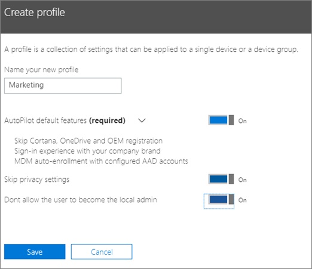

# AutoPilot-profilok létrehozása és szerkesztéseCreate and edit AutoPilot profiles

## Profil létrehozásaCreate a profile

A profil egy eszközre vagy eszközök csoportjára vonatkozik.A profile applies to a device, or a group of devices,
  
1. A Microsoft 365 Vállalati felügyeleti központban válassza az **Eszközök** \> **AutoPilot**lehetőséget.In the Microsoft 365 Business Admin center, choose **Devices** \> **AutoPilot**.
  
2. Az **AutoPilot** lapon válassza \*\*\*\* a \> Profilok lapot **Profil létrehozása**.On the **AutoPilot** page, choose the **Profiles** tab \> **Create profile**.
    
3. A **Profil létrehozása** lapon adja meg a profil nevét, amely segít azonosítani azt, például a Marketing.On the **Create profile** page, enter a name for the profile that helps you identify it, for example Marketing. Kapcsolja be a kívánt beállítást, majd kattintson a **Mentés gombra.**Turn on the setting you want, and then choose **Save**. Az AutoPilot profilbeállításairól további információt [az AutoPilot-profil beállításairól című témakörben](autopilot-profile-settings.md)talál.For more information about AutoPilot profile settings, see [About AutoPilot Profile settings](autopilot-profile-settings.md).
    
    
  
### Profil alkalmazása eszközreApply profile to a device

Miután létrehozott egy profilt, alkalmazhatja azt egy eszközre vagy eszközcsoportra.After you create a profile, you can apply it to a device or a group of devices. A [részletes útmutatóban](add-autopilot-devices-and-profile.md) kiválaszthatja a meglévő profilt, és alkalmazhatja azt új eszközökre, vagy lecserélhet egy meglévő profilt egy eszközre vagy eszközcsoportra.You can pick an existing profile in the [step-by-step guide](add-autopilot-devices-and-profile.md) and apply it to new devices, or replace an existing profile for a device or group of devices. 
  
1. **A Windows előkészítése** lapon válassza az **Eszközök** fület.On the **Prepare Windows** page, choose the **Devices** tab. 
    
2. Jelölje be az eszköznév melletti jelölőnégyzetet, és az **Eszköz** panelen válasszon egy profilt a **Hozzárendelt profil** legördülő \> **listából Mentés**.Select the check box next to a device name, and in the **Device** panel, choose a profile from the **Assigned profile** drop-down list \> **Save**.
    
    
  
## Profil szerkesztése, törlése vagy eltávolításaEdit, delete, or remove a profile

Miután hozzárendelt egy profilt egy eszközhöz, frissítheti azt még akkor is, ha már odaadta az eszközt egy felhasználónak. Amikor az eszköz csatlakozik az internethez, a beállítási folyamat során letölti a profil legújabb verzióját. Ha a felhasználó visszaállítja az eszköz gyári alapértelmezett beállításait, az eszköz ismét le fogja tölteni a profil legújabb frissítéseit.Once you've assigned a profile to a device, you can update it, even if you've already given the device to a user. When the device connects to the internet, it downloads the latest version of your profile during the setup process. If the user restores their device to its factory default settings, the device will again download the latest updates to your profile. 
  
### Profil szerkesztéseEdit a profile

1. **A Windows előkészítése** lapon válassza a **Profilok** fület.On the **Prepare Windows** page, choose the **Profiles** tab. 
    
2. Jelölje be az eszközneve melletti jelölőnégyzetet, és a **Profil** panelen frissítse a rendelkezésre álló beállítások \> bármelyikét **Mentés**.Select the check box next to a device name, and in the **Profile** panel, update any of the available settings \> **Save**.
    
    Ha ezt azelőtt végzi el, hogy a felhasználó csatlakoztatná az eszközt az internetre, akkor a profilt a rendszer alkalmazza a beállítási folyamatra.If you do this before a user connects the device to the internet, then the profile gets applied to the setup process.
    
### Profil törléseDelete a profile

1. **A Windows előkészítése** lapon válassza a **Profilok** fület.On the **Prepare Windows** page, choose the **Profiles** tab. 
    
2. Jelölje be az eszközneve melletti jelölőnégyzetet, majd a **Profil panelen** válassza a \> Profil **mentése** **törlése lehetőséget.**Select the check box next to a device name, and in the **Profile** panel, select **Delete profile** \> **Save**.
    
    A törléssel a profilt eltávolítja arról az eszközről vagy abból az eszközcsoportból, amelyhez hozzá volt rendelve.When you delete a profile, it gets removed from a device or a group of devices it was assigned to.
    
### Profil eltávolításaRemove a profile

1. **A Windows előkészítése** lapon válassza az **Eszközök** fület.On the **Prepare Windows** page, choose the **Devices** tab. 
    
2. Jelölje be az eszköznév melletti jelölőnégyzetet, és az **Eszköz** panelen válassza a \> **Hozzárendelési profil** mentés i. listájának Nincs **elemét.** \*\*\*\*Select the check box next to a device name, and in the **Device** panel, choose **None** from the **Assigned profile** drop-down list \> **Save**.
    
