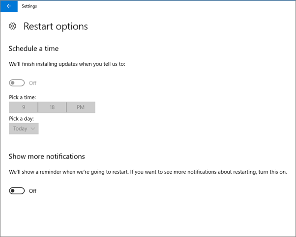

# Eszközvédelmi beállítások érvényességének ellenőrzése Windows 10-es PC-ken

## Windows 10-eszközházirendek érvénybe lépésének ellenőrzése

Miután [beállította az eszközházirendeket](protection-settings-for-windows-10-pcs.md), néhány óra is eltelhet, amíg a házirendek érvénybe lépnek a felhasználók eszközein. A házirendek érvénybe lépéséről úgy bizonyosodhat meg, ha ellenőrzi a felhasználók eszközein a Windows Gépház bizonyos beállításlapjait. Mivel a felhasználók nem tudják módosítani a Windows Update és a Windows Defender víruskereső beállításait a Windows 10-es eszközeiken, számos lehetőség szürkén jelenik meg.
  
1. Nyissa meg a **Beállítások** \> **frissítése &amp; biztonsági** \> **Windows Update** \> Újraindítás **beállításait,** és ellenőrizze, hogy az összes beállítás szürkén jelenik-e meg. 
    
    
  
2. Nyissa meg a **Beállítások** \> **frissítése &amp; biztonsági** \> **Windows Update** \> Speciális **beállításokat,** és ellenőrizze, hogy az összes beállítás szürkén jelenik-e meg. 
    
    
  
3. Go to **Settings** \> **Update &amp; security** \> **Windows Update** \> **Advanced options** \> **Choose how updates are delivered**.
    
    Ellenőrizze, hogy látható-e az üzenet (pirossal) arról, hogy egyes beállítások rejtve vannak vagy a szervezet által kezeltek, és az összes beállítás szürkén jelenik meg.
    
    
  
4. To open the Windows Defender Security Center, go to **Settings** \> **Update &amp; security** \> **Windows Defender** \> click **Open Windows Defender Security Center** \> **Virus &amp; thread protection** \> **Virus &amp; threat protection settings**. 
    
5. Ellenőrizze, hogy minden beállítás szürkén jelenik-e meg. 
    
    
  
## Kapcsolódó témakörök

[A Microsoft 365 Business dokumentációja és forrásai](https://go.microsoft.com/fwlink/p/?linkid=853701)
  
[A Microsoft 365 Business használatbavétele](microsoft-365-business-overview.md)
  
[A Microsoft 365 Business kezelése](manage.md)
  
[Eszközkonfigurációk megadása Windows 10-es PC-ken](protection-settings-for-windows-10-pcs.md)
  

